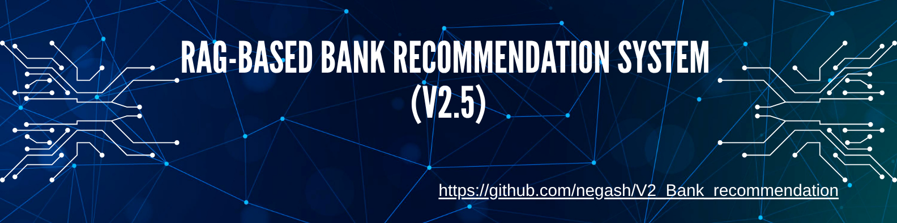
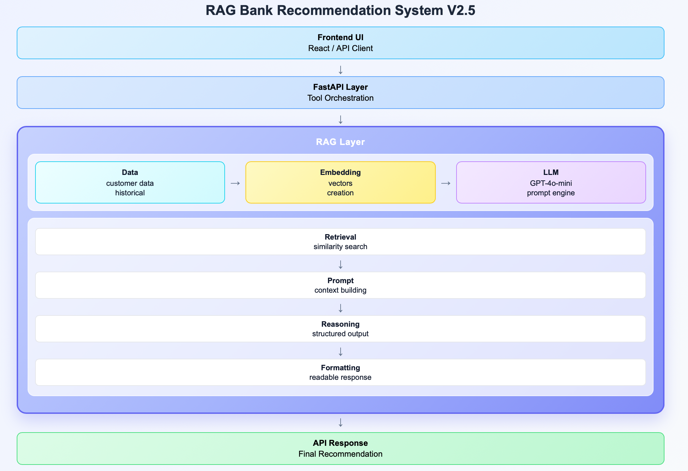

# **🏦** RAG-Based Bank Recommendation System (v2.5)


An AI-powered **Banking recommendation system** built using **Retrieval-Augmented Generation (RAG)**. 
It combines semantic search with large language models to generate **data-grounded financial recommendations**.

---

## 🚀 Why This Project?

Traditional rule-based systems struggle with personalization. 
This project demonstrates how to:

- Combine **vector similarity search (FAISS)** with LLMs
- Generate **context-aware recommendations** 
- Build **explainable AI systems** using structured data 

---

## 🎥 Demo


## **👉** [Watch full demo video](assets/demo.gif)

## ✨ Features

- 🔍 Semantic customer matching via embeddings 
- 🧠 RAG-based recommendation engine 
- ⚙️ LLM + tool-calling architecture 
- 📊 Data-grounded outputs (not hallucinated) 
- 🔒 Modular and production-ready design 

## **🏗️** Architecture



**Flow:**

1. Convert customer data → embeddings 
2. Retrieve similar customers (FAISS) 
3. Build context-aware prompt 
4. Generate recommendation using LLM
5. Format structured response 

---

## ⚙️ Quick Start

```bash

git clone https://github.com/negash/V2_Bank_recommendation

cd V2_Bank_recommendation

pip install -r requirements.txt

Add your API key:

export OPENAI_API_KEY="your_api_key_here"
Then run your app in the same terminal session.

(optional)
Make it permanent
Add it to your shell config:

~/.bashrc or ~/.zshrc
```
---

## ▶️ Run the API

uvicorn scripts.api:app --reload

## 🧪Example Usage

**Request**

curl -X POST "http://127.0.0.1:8000/recommend" \

-H "Content-Type: application/json" \

-d '{"name": "Alice Brown"}'

**Response (Example)**

{

   "message": "Based on similar customers, Alice Brown may benefit from a high-yield savings account and investment portfolio optimization."

}

## 🧠 How It Works

 **Embedding Layer**

  Converts customer attributes into vector representations
 **Retriever (FAISS)**

  Finds similar customers based on semantic similarity
 **RAG Pipeline**

  Injects retrieved data into LLM prompts
 **LLM Generation**

  Produces grounded, explainable recommendations

## 📁 Project Structure

bank-recommendation-rag/

│── embeddings/         Embedding generation

│── retriever/          Similarity search (FAISS)

│── llm/                Prompt + generation pipeline

│── tools/              Core RAG recommendation logic

│── data/               Customer dataset

│── scripts/            API entrypoint

│── config/             Settings

## 🧰 Tech Stack

* **Python**
* **FastAPI**
* **OpenAI GPT API**
* **FAISS (Vector Database)**
* **NumPy**
* **RAG (Retrieval-Augmented Generation)**

## CI/Quality

This project includes a **GitHub Actions pipeline** that:

* Installs dependencies
* Runs lint checks
* Validates core imports

## Future Improvements

*  Add unit + integration tests (pytest)
*  Retrieval evaluation 
*  Docker support
*  Cloud deployment (AWS / GCP / Render)
*  Monitoring & logging

## 🧾 Closing Notes

This project showcases a **real-world RAG application** in the banking domain, demonstrating how to:

* Bridge structured data with LLM reasoning
* Build reliable AI systems with reduced hallucination
* Design scalable, modular AI architectures

## 👤 Author

**Negash Bezabeh**

## 📄 License
This project is licensed under the [MIT License](LICENSE).

